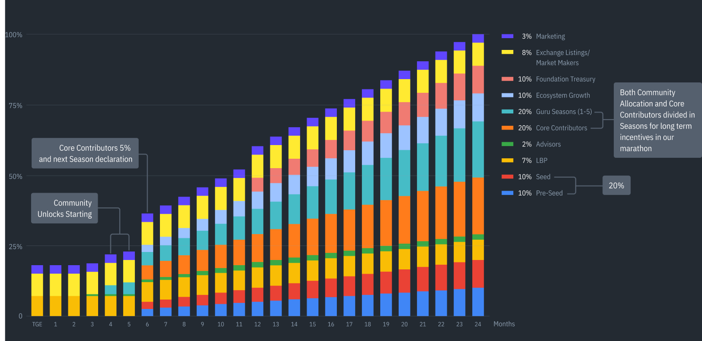

# [PROPOSAL-001] Guru Network Core Contributors Incentives and Governance 

## Summary

This proposal outlines the incentive distribution plan for the Guru Network Core Contributors DAO, focusing on community engagement, core contributor rewards. The aim is to ensure transparency, accountability, and sustained growth for the Guru Network.

## Background

The Guru Network has consistently delivered high-impact products, including the Block Explorer, Data Warehouse, Flow, DexGuru V2, and Terminal integration, within a year. Our team, composed of seasoned Web3 professionals, has navigated both the highs and lows of the DeFi landscape. As we prepare for the next phase of growth, establishing a structured governance and incentive framework is crucial to maintaining our momentum and fostering a collaborative ecosystem.

## Proposal

### Incentive Distribution Plan

To ensure the long-term prosperity of the Guru Network, we propose the following:

1. **Create Core Contributors Seasons** and align them with Community Incentives Seasons in terms of periods and distributed allocation.
2. **Setup a Core Contributors Governance Framework** tasked with developing and proposing a Community Governance Framework before the Guru Network Mainnet launch.

Out of the total token supply, 40% is allocated for distribution between Community and Core Contributors as follows:

- 
- **20% for Guru Seasons 1-5 Community:**  
  Rewarding Season Pass NFT holders and active community participants. The distribution is divided into seasons, with Seasons 1-2 are gaining and boosting rewards by participation now (Testnet phase). Activities snapshot will be done close to the Mainnet launch. Community Seasons 3-5 planned for the next 24 months as a continuous community incentives aligned with Core Contributors Seasons.

- **20% for Core Contributors:**  
  Divided into seasonal allocations starting now with the Guru Network testnet phase. Governance and voting begin with core contributors, evolving into a polished Community Governance framework by the Mainnet launch. The current list of core contributors can be found here: [Core Contributors](../CORE_CONTRIBUTORS.md).

### Core Contributors Incentive Distribution Mechanism

**Proposed unlocking system for the core contributors’ allocation:**

- **First Unlock:**  
  In six months starting from today, 25% of the core contributors’ allocation will be unlocked. Distribution will follow a traditional half-year/yearly review system based on contributions during the Testnet phase, Mainnet Launch, and Ecosystem Growth.

- **Subsequent Unlocks:**  
  Every six months, another 5% will unlock, maintaining rewards based on continuous performance.

### Community Incentive Distribution Mechanism

The community’s 20% allocation will be unlocked in phases (Seasons 1-5), encouraging ongoing engagement and contributions. Eligible community members include Season Pass NFT holders and active participants.

### Governance Framework

The Community and Core Contributors Governance framework will be adjusted and proposed for discussion before Mainnet Launch. The framework proposed for Season 1 ([GuruDAO Bootstrap Guide](https://docs.dex.guru/gurudao/gurudao-bootstrap-guide)) will be adjusted to modern-day realities. The process will be public to ensure that no interested parties can back off those decisions without public consequences.

A Multisig Safe with a balanced voting system will be used to provide every core contributor with a voice and voting rights. This system, combined with our Core Contribotors Seasons planned for the next two years, creates long-term incentives for the core contributors team.

### List of Core Contributors

[Core Contributors](../CORE_CONTRIBUTORS.md)

## Specifications

N/A

## Pros

- Encourages active community engagement and contributions.
- Provides a structured and transparent reward system for core contributors.
- Recognizes the significant role of VCs in supporting Guru Network’s growth.

## Cons

- Requires careful management to ensure fair distribution and governance.
- Potential challenges in maintaining consistent engagement and contributions from the community.
