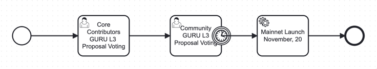

# [PROPOSAL-002] Guru Network Mainnet Launch Initiative

---

### Summary  

This proposal outlines the agreement among Core Contributors (CC) that we are ready to launch Guru Network L3 on Base Mainnet on **November 20, 2024**. It includes the planned Phase 1 feature set, launch mechanism, and the introduction of community-driven governance, ensuring alignment between contributors, ecosystem growth, and community engagement.

---

### Background  
Guru Network has reached a point where robust infrastructure is essential to advance ecosystem products developed during the Testnet phase (*Guru App, Burning Meme, DexGuru, Data Warehouse, Block Explorer, AI Orchestration Node*). These products have laid the foundation for the network's evolution into a comprehensive Web3 infrastructure centered on **AI and process orchestration**. 

As we approach the Mainnet launch, establishing structured governance mechanisms and incentivizing community involvement are crucial for driving network growth.

---

### Proposal

**1. Agreement to Launch Guru Network L3 on Base**  
Core Contributors agree to move forward with the launch of the Guru Network L3 on Base Mainnet, targeting **November 20, 2024**, as the official launch date. 

**2. Phase 1 Features**  
The network will launch with a foundational feature set that enables future AI and process orchestration use cases, including:
   - **Superbridge** (Base GURU - Mainnet GURU)
   - **Guru** as Native Token
   - **WGURU**
   - **Governance mechanisms** for Season NFT holders and rewards
   - **Guru Swap** (WGURU/WETH, WGURU/{MEMECOINS})
   - **AI Memecoins Launchpad** (Burning Meme)

These features establish the groundwork for onboarding IaaS use cases focused on AI and orchestration via the Guru Orchestration Node.

**3. Coordinated Mainnet Launch and Community Governance Introduction**  
The launch will be coordinated with the November 20 target, while incorporating a governance framework allowing the community to vote on the launch.

**4. Community Governance Mechanism**  
Community governance will be enabled through the possession of **GURU Season NFTs**. A new season of NFTs will be introduced for recently joined community members.

**5. “I Launched” Status for Voting Community Members**  
Community members who vote in favor of the Mainnet launch will receive the **“I Launched”** status as a recognition of their support and involvement in this pivotal network milestone.

**6. Voting Access via Guru App**  
Voting will be available within the **Guru App** as a quest exclusively for NFT holders, providing a streamlined and engaging method for community members to participate in governance.

---